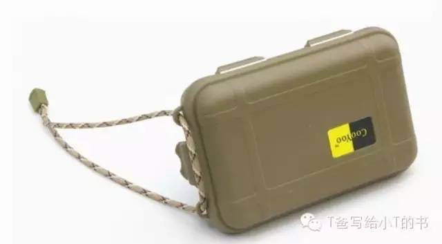
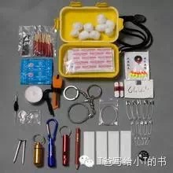

# 宝盒 - T爸写给小T的书

## 准备

老爸已经30岁了，但 “生存与冒险”这一部分的内容仍然是我的最爱，所以我把《冒险家卷》放到了第一卷，因为，有一个叫亚里士多德的伟大哲学家说过：“勇气是最好的美德”。之后在《哲学卷》里会有很多他的故事。

“冒险”绝对不是“置身于危险”，而是“学习、尝试、探索、体验成功或失败、再学习”的一个过程，而这个过程中最重要的就是：享受乐趣。

这里的冒险包括了：制作玩具、制作工具、制作道具、制作物品、进行科学实验，野外探险等。

但在正式出发“冒险”之前，我们一起来准备一些东西。

## 宝盒

在冒险时，很多小物品可能会起到关键性的作用，所以，去准备两个烟盒大小的盒子，最好是硬金属做成的，把下面我提到的这些东西放进来，做一个宝盒，定期检查每一样东西，如果发现哪个物品失效了，更换它。在冒险时，记得随身携带它，最好把它放到外衣口袋里。

- 打火石

再好的打火机和火柴，都没有打火石可靠。即使在潮湿的下雨天，它仍然能用。当打火机和火柴都用完的时候，它还可以继续生火。现在市面上有带镁条助燃的打火棒，非常不错，不过，镁金属燃点很低，要注意安全。

- 火柴

在一个寒冷的夜晚露宿野外，一盒火柴会非常有用。被打湿的火柴是没有用的，你可以用蜡烛油包住火柴头，既可以防止自燃，又可以防水，只是在使用之前要小心的将蜡弄掉。

- 蜡烛

蜡烛即可以生火，又可以照明，在某些情况下是无价之宝。记住，蜡烛绝对不可以吃。另外，还可以用动物的油脂做蜡烛。

- 放大镜

除了有放大作用，还可以在太阳下聚集光线生火。

- 指南针

一个钮扣大小的液态填充型指南针是非常有用的。特别是男孩，随时清楚方向，知道自己在哪，知道目的地在哪的男孩是很帅的，可以让女孩可以依靠。

- 针线

可以修补被刮破的衣服，可以缝合伤口。选择那些优质耐磨的线，并缠绕在针上。

- 鱼钩和鱼线

小鱼钩可以钓到大鱼，也可以钓到小鱼，鱼线还可以用来捕鸟（之后我会教你制作各种机关）。

- 胶带

不用太多，在一些情况是非常有用的。

- 铅笔和纸

随身带铅笔和纸是非常好的习惯，可以记录事件，记录方向等。任何电子设备都不会有铅笔和纸来得快，而且不会没有电。

- 手帕

可以防止吸入烟尘，浸湿后可以加强过滤空气，女孩哭泣的时候可以递给她。

- 酒精

用一个小药瓶装一些酒精，可以用来消毒，也可以用来生火。

- 塑料带

防水的好材料

- 棉花

用棉花塞满宝盒的空余空间，要需要时，它可以点火，也可以防止里面的物品碰撞发出的声音。

