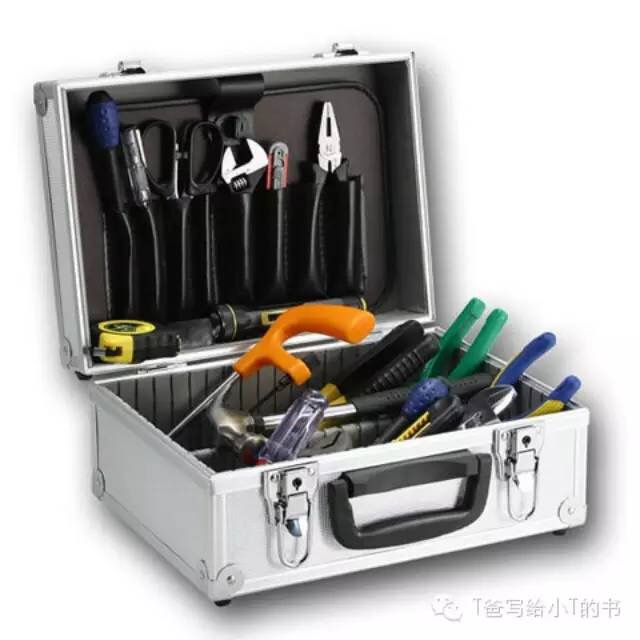

# 工具箱 - T爸写给小T的书

男孩都应该有自己的一个专用工具箱，里面装着各种常用工具，比如起子，扳手之类的，它可以用来制作玩具，道具，实验器材等。这个工具箱并不需要你随身携带，可以放在自己的工作台上。

爸爸小时候的第一个工具箱是用一个铁制文具盒做的，当时四驱玩具车非常流行，为了组装自己的车，我就从各种不同的地方收集各种工具。现在网络上可以很容易买到成套的工具箱，但至少有下列东西：

- 起子

    一字起、十字起，

- 锤子

    铁锤、橡胶锤

- 钳子

    尖嘴钳、平口钳、老虎钳

- 直尺

- 卷尺

- 扳手

- 小锯子

- 小刀

- 剪刀

- 透明胶带

- 胶水

- 一些螺丝

- 铜线

- 砂纸

    80目，120目，200目

等你长大到10岁，就可以使用这一些电动工具：

- 电烙铁

- 万用表

- 示波器

等你长大到14岁，就可以使用这一些电动工具：

- 电钻

- 电磨

准备好了这些，我们就可以开始自己制作玩具了。