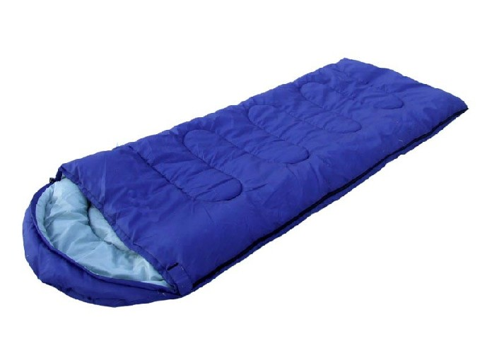
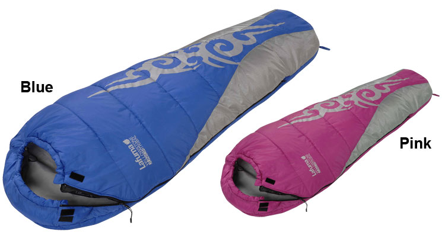
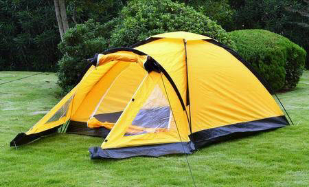
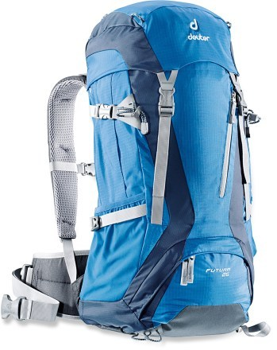
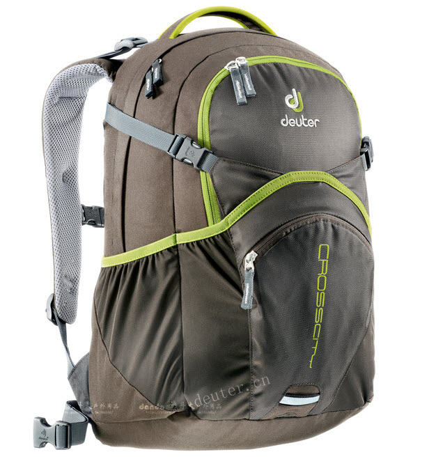
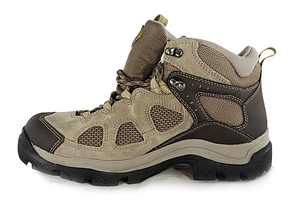
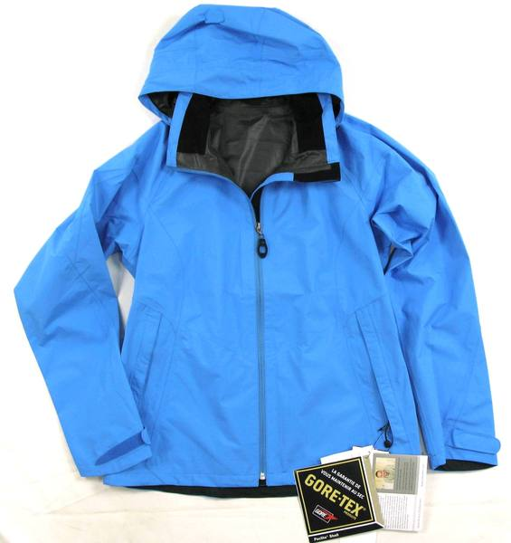
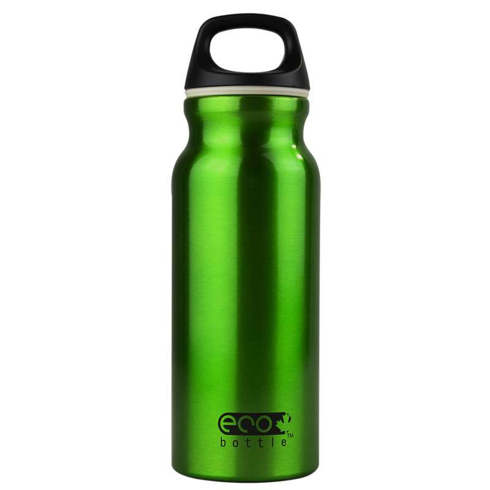
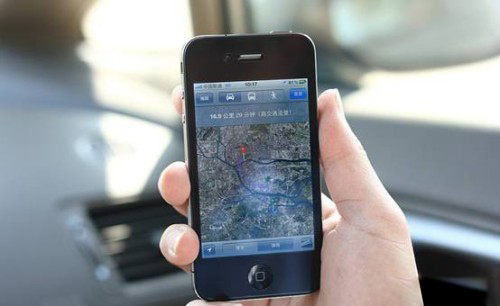

# 户外探险装备 - T爸写给小T的书

- 睡袋
在进行野外冒险时，一个温暖的睡袋是必须的。这个由爸爸来准备。睡袋一般有两种：

    - 棉质睡袋
    棉质睡袋较便宜，但保暖效果不如羽绒的好，如果是夏季出行，应选用这一种。

    

    - 羽绒睡袋
    羽绒睡袋最大的缺点就是必须保持干燥，如果弄湿了，不仅失去保温效果，而且很难晾干。另外羽绒睡袋体积通常比棉质睡袋大。

    
    
- 帐篷
一般选择双人帐篷，一家人出去进行野外冒险时非常合适。现在有一种自动收放的帐篷，很方便，但选一个质量好，安全可靠的帐篷非常重要。这个由爸爸来准备。

- 背包
背包用来携带衣服和必要装备。爸爸会选择一个能负担的质量最好的背包，一个好的背包应该有内部构架来组成背负系统，可以节省不少体力，背包与背部之间有空气流通的空间，利于排汗，材料一定是防水性耐磨性较好的，配有防雨罩，可以安全的装载各种物品，一个不结实不防水的背包一路上会让你狼狈不堪。

背包负重的秘诀是，将大部份重量分担在臀部---这是身体最有韧性，又极其耐劳的地方，而肩膀和背部很容易疲惫。所以要将重物装在背部底部，轻的东西放在上面。当然，这个也由爸爸来准备。

- 着装
我们首先选好鞋子，在户外探险时，一双舒适的既防水又透气的鞋子非常重要。在动身两周前就要试穿新鞋子直到合脚。千万不要穿新鞋子出行，这样脚会很容易打出泡。

千万别买到假货，一双不结实的鞋子如果坏在路上，会是件很痛苦的事情。

纯棉的服装虽然很舒服，但我们绝对不要选用，因为当汗水浸湿了纯棉的服装后，很容易贴在皮肤上，让我们迅速感冒，而且很难干。GORE-TEX是种新型的材料，防水性能和透气性都非常好，就算湿了也不会贴在皮肤上，在太阳下只需要很短的时间就会完全干透。

另外，千万不要选用迷彩的服装，当你迷路时，迷彩服会让我找不到你，战士穿迷彩服是为了不让敌人发现，但当你陷入困境时，服装的颜色越吸引注意力越好。所以，最好选用蓝色或橙色。

- 水壶
我会替你选一个铝制水壶，轻便，安全，也可以在火上加热。记住，水壶的安全是非常重要的，我们没有食物可以活三周，没有水，三天都活不了。水是优先考虑的问题，千万不要到没有水的时候再去找水，我会在之后花一个章节的内容来讲和水有关的知识。

- GPS
GPS是一种电子设备，它通过卫星发送信号，所以在全球任何地方你都可以准确知道你在什么位置。

当然，GPS并不是必需品，但现在大多数智能手机都有GPS全球定位系统，所有，学会使用它是很有用的，它的导航功能可以让旅途变得轻松很多。但是GPS系统耗电量较大，智能手机的电池电量通常会不够，所有最好预备好两块充电宝。

千万不要过分依赖任何使用电池的设备，有可能在面临危险最需要它时，它却没有电了或者进水不能使用。在特别炎热或特别寒冷的地方，电池电量消耗极快。所以你仍旧需要学会使用地图。