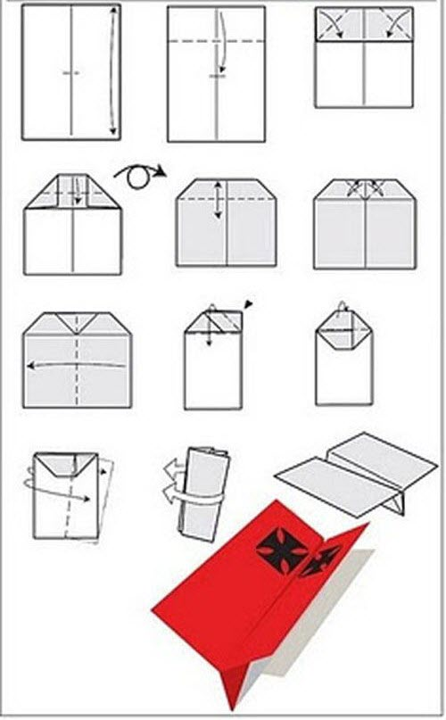

# 制作纸飞机 - T爸写给小T的书

纸飞机品种较多，而且都没有命名，所以我用英文给他们命名，我会告诉你它的中文意思。每一种飞机爸爸都会和你一起来折，一人折一个，如果你碰到了困难，爸爸也会帮助你。

- Glider #1滑翔1号
 

- Glider #2 滑翔2号
 

- ROCK 摇滚飞机

 
- Canard 鸭式飞机

 
- Delta 三角洲

 
- Shuttle 太空梭

 
- Wild 野外
 

- Lock 锁

 
- Hawkeye 鹰眼

 
- Triple 三翼
 

- Needle 针

 
- Little Boy 小男孩

