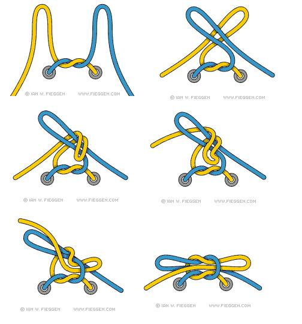

# 几种绳子打结的方法 - T爸写给小T的书

在写这一部分之前，我问了很多人“你知道什么打结的方法吗？”，大多数人只知道一两种方法。会打各种结是非常有用的，比如系鞋带、绳索的连接、钓鱼时的鱼钩结、制作绳环、制作绳梯、制作陷阱、制作木船、编绳网、捆绑东西，攀岩，骑马等。打结的方法有近100种，不过我只教你几种最有用的打结方法。

记忆打结的方法很难，需要很强的空间想象能力，并且要花费很长的时间去练习，所以，当你在练习时遇到困难，不要放弃，因为你在锻炼你的空间想象力，之后对你要学习的几何学和美术都非常有帮助，而且爸爸会耐心的教你。

另外，爸爸会为你准备伞绳来练习，暂时不要用太细的尼龙绳（如钓鱼线，风筝线），因为它们在拉力较大时会变得很锋利，容易受伤。之后爸爸还会教你如何用植物或其他纤维制作绳子。

- 平结

- 普通鞋带

- 8字结

- 单套环

- 丁香结

