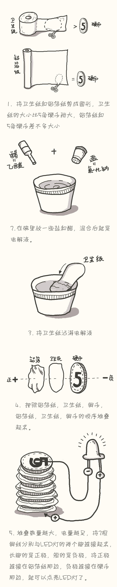

# 制作电池 - T爸写给小T的书

最简单的电池是由阴极、阳极和中间的电解液组成的。

准备材料：
①	10枚5角的硬币（铜制）
②	铝箔纸
③	小LED灯泡（如果找不到，请求助网络，或者你来找我要也可以）
④	一些铜线
⑤	醋
⑥	卫生纸
⑦	盐
⑧	胶带
⑨	碗

开始制作：

为什么这样的组合可以产生电流呢？现在你想象有个金属小朋友，他叫“锌”，是个很活泼的小朋友，他有很多很小很小的球，而且喜欢把球给别人玩。他的这些小球都是负的，就像人有男和女，这些球有正有负。这时，有另外一个金属小朋友，他叫“铜”，也有一些小球，不过他很懒惰，但是他却很喜欢负的小球。所以“锌”小朋友就不停的把自己的负的小球给“铜”。

负的小球我们叫它“电子”，正的小球我们叫它“质子”，而且这些小球是永远不会破掉的，它们永远存在，从有这个世界起它们的就在，而且会一直都在。
 
这些小球在传的过程中，就产生了电。另外，传球的速度我们叫做“电压”，传球的数量我们叫做“电流”。如果电压到达了36伏特，对我们人就非常危险，家里的墙壁上那些插板的电压是220V, 所以千万不要去碰它们，会有生命危险。
